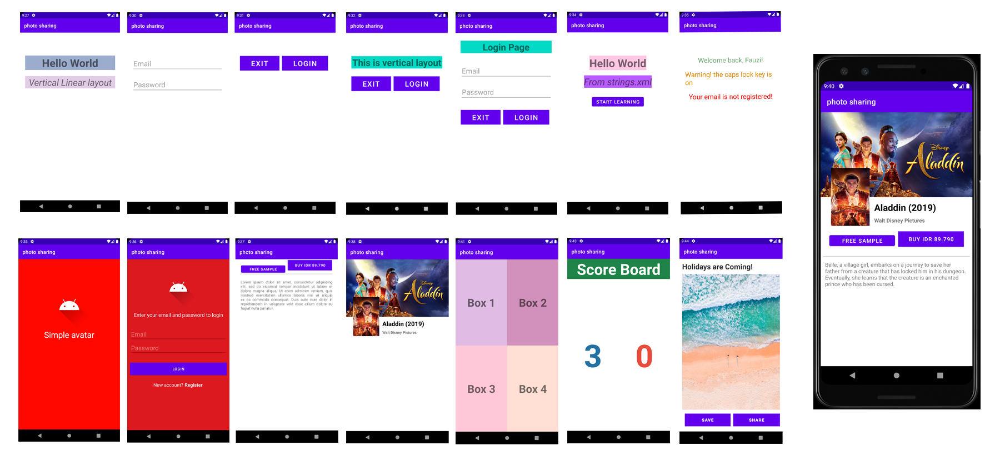

# LearningUIDesign-AndroidStudio

Hasil Pembelajaran Learning UI Design.

Mencoba memulai beberapa feature pada Java - Android Studio seperti :
  - Linear Layout
  - Relative Layout
  - Constraint Layout
  - Grid Layout
  

